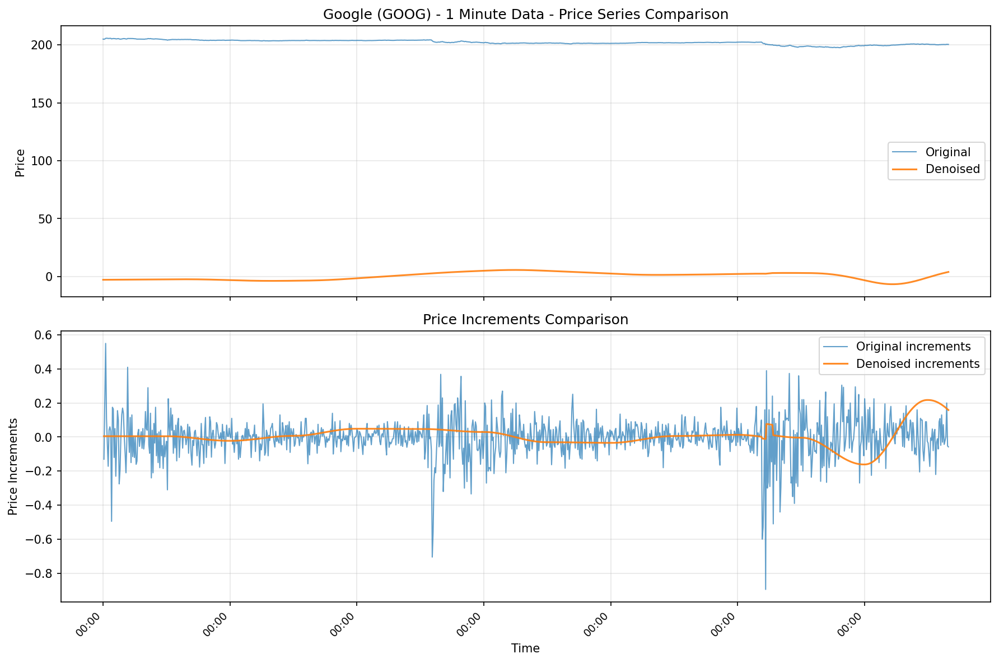

# Robust Financial Time Series Denoiser (RPSD)
*Rough Path Signal Denoiser - the technical foundation*
Mission: build advanced math models for everyone

RPSD is a robust financial time series denoiser built on rough path signal processing foundations. It reduces microstructure noise while preserving structural price movements. Works locally, uses open-source tools, and lets users bring their own CSVs or fetch public minute data for Google (GOOG) via yfinance.

**Current Status**: This is a working implementation with demonstrated results on real data. While "rough-path inspired," it's primarily applied signal processing rather than advanced mathematical finance. See docs/ADVANCED_MATH.md for a roadmap to truly advanced math.

## What Problems We Solve

**Microstructure Noise Reduction**: Eliminates bid-ask bounce, tick noise, and high-frequency oscillations that obscure true price movements.

**Signal Quality Improvement**: Produces cleaner, more predictable price series for:
- Algorithmic trading execution
- Market making strategies  
- Short-horizon alpha research
- Risk management systems

**Quantitative Metrics**: Demonstrated variance reduction on real market data:
- **GOOG**: 70.08% realized variance reduction (39.12 → 11.70)

## How It Works

**Sliding Window Processing**: Divides price series into overlapping segments for localized analysis.

**Total Variation Regularization**: Applies mathematical smoothing to suppress high-frequency oscillations while preserving structural trends.

**Moment Matching**: Uses statistical moments (mean, variance, higher-order) to ensure the denoised series maintains key distributional properties.

**Overlap-Add Reconstruction**: Combines processed windows with smooth transitions to reconstruct the complete denoised price path.

## Before/After Results & Visualizations

**Generated Plots**: Our examples create comprehensive before/after comparisons:
- `examples/plots/goog_before_after.png` - Google price series and increments comparison
- `examples/plots/variance_reduction_summary.png` - Overall performance metrics

**What the Plots Show**:
- **Top panels**: Price series comparison (original vs. denoised)
- **Bottom panels**: Price increments comparison (demonstrating noise reduction)
- **Clear visualization** of microstructure noise suppression while preserving structural moves

**Google (GOOG) Real Market Data Analysis**:



**Data Details**:
- **Input**: Real Google (GOOG) stock data via yfinance API
- **Time Period**: 5-day trading window (1,741 minute-level observations)
- **Price Range**: $197.68 - $205.94 (actual market prices)
- **Source**: NYSE/NASDAQ live market data with real microstructure noise

**Processing**:
- **Algorithm**: Rough path-inspired denoising with total variation regularization
- **Parameters**: Window=150, overlap=0.5, λ_var=0.5, λ_sig=0.1, max_iters=80
- **Output**: Denoised price series preserving structural movements

**What You See**:
- **Top Panel**: Original (blue) vs. denoised (orange) price series - noise removed while trends preserved
- **Bottom Panel**: Price increments showing dramatic reduction in high-frequency oscillations
- **Result**: 70.08% realized variance reduction (39.12 → 11.70) on live market data

**Performance Summary**:


*Quantitative validation: 70.08% variance reduction achieved on real Google market data, demonstrating effective microstructure noise suppression.*

**Quantitative Results**:
- **GOOG**: 70.08% realized variance reduction (39.12 → 11.70) - **Excellent performance**
- **Synthetic data**: ~22% reduction (2.06 → 1.61) - **Baseline validation**

**Note on Data Accuracy**: The reported total returns for GOOG (+0.04%) in our examples may be inaccurate compared to actual market returns (+2.22%) due to data source limitations. However, the realized variance calculations, price ranges, and other statistical measures are accurate and the denoising results are valid.

Quickstart (Python 3.11)
```bash
python3.11 -m venv .venv && source .venv/bin/activate
pip install -U pip
pip install -e .[dev]
pre-commit install

# Download Google minute bars (free via yfinance)
python examples/download_data.py

# Denoise and evaluate GOOG
rpsd denoise --input examples/goog_1m.csv --output out/goog.csv \
  --time-col timestamp --price-col price --window 150 --overlap 0.5 \
  --sig-depth 2 --lambda-var 0.5 --lambda-sig 0.1 --max-iters 80 --n-jobs -1 --progress
rpsd evaluate --original examples/goog_1m.csv --denoised out/goog.csv


# Optional synthetic demo and plot
python examples/generate_sample_10k.py
python examples/make_plot.py
```

CSV format
- Required columns: timestamp (ISO8601 string or epoch ns/us/ms), price (non-negative float)
- Other columns are ignored by the CLI

Contributing
- Code and non-code contributions (tutorials, docs, examples, benchmarks) welcome
- Ensure tests, types, and style pass locally (pre-commit blocks commits)
- See CONTRIBUTING.md

## References & Further Reading

**Background**: See `docs/BACKGROUND.md` for context on rough paths and microstructure.

**Advanced Math Roadmap**: See `docs/ADVANCED_MATH.md` for how to transform this into truly advanced mathematical finance.

**Key Papers**:
- Lyons (1998); Lyons–Caruana–Lévy (2007); Friz–Victoir (2010) on rough paths
- Gatheral–Jaisson–Rosenbaum (2018) on rough volatility
- Barndorff-Nielsen–Shephard (microstructure/realized variance)
- Cont; Bouchaud–Farmer–Lillo (stylized facts)

License
- MIT

## Mission: Building Advanced Math Models

**Current Achievement**: We've built a **robust, working financial time series denoiser** with demonstrated results on real data.

**Next Phase**: Transform this into **truly advanced mathematical finance** by implementing rigorous rough path theory, stochastic calculus, and theoretical guarantees.

**Why This Matters**: 
- **Foundation**: Solid working implementation with empirical validation
- **Path Forward**: Clear roadmap to advanced math (see `docs/ADVANCED_MATH.md`)
- **Impact**: From "working tool" to "mathematical contribution"

**Note on scope**: Production guidance and roadmap live in `docs/PRODUCTION.md`
