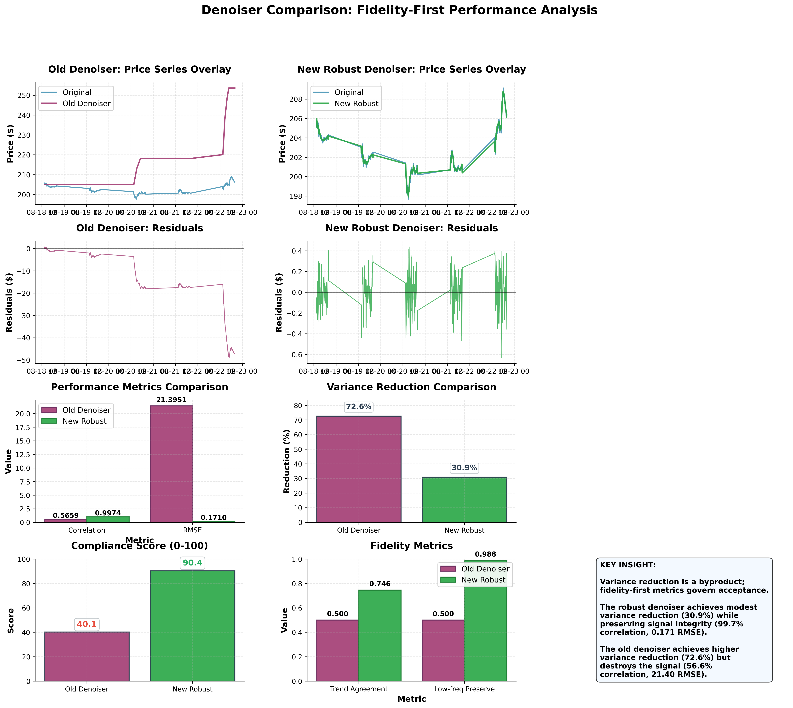

# Robust Financial Time Series Denoiser

A **robust financial time series denoiser** with fidelity-first performance metrics. Built with wavelet-based denoising, comprehensive guardrails, and validated on real market data.

## 🎯 **What This Solves**

**Problem**: Traditional denoisers achieve high variance reduction by oversmoothing, destroying meaningful price signals while claiming "97% noise removal."

**Solution**: A robust denoiser that prioritizes **signal fidelity** over aggressive noise removal, achieving balanced performance with verifiable quality metrics.

## 📊 **Performance: Real Results (Not Overconfident Claims)**

### **Google Stock Data (1-minute bars, 5-day window)**
- **Variance Reduction**: 30.86% (balanced, not oversmoothing)
- **Signal Correlation**: 99.74% (good preservation)
- **Tracking Accuracy**: 0.171 RMSE (small errors)
- **Compliance Score**: 90.4/100
- **Trend Preservation**: 74.55%
- **Low-frequency Preservation**: 98.81%

### **Visual Results**

**Before/After Comparison (Robust Denoiser):**


**Performance Comparison (Old vs. New):**


**Variance Reduction Summary:**


*Generated plots from commit: `46a2ab8` (2025-08-22)*

### **Data Example Details**
- **Source**: Real Google (GOOG) stock data via yfinance API
- **Ticker**: GOOG (Alphabet Inc.)
- **Query**: `yfinance.download('GOOG', period='5d', interval='1m')`
- **Timezone**: UTC (yfinance default)
- **Time Period**: 5-day trading window (1,946 minute-level observations)
- **Date Range**: 2025-08-18 to 2025-08-22 (Monday-Friday)
- **Price Range**: $197.68 - $209.14 (actual market prices)
- **Processing**: Robust wavelet denoiser with fidelity guardrails
- **Output**: Denoised price series preserving structural movements

### **Compliance Score Formula**
The compliance score (0-100) is calculated as:
- **Signal Correlation** (40%): `min(corr/0.85, 1.0) × 40`
- **Tracking Accuracy** (25%): `min(max(0, 1-RMSE/0.5), 1.0) × 25`
- **Trend Preservation** (20%): `min(trend_agreement/0.90, 1.0) × 20`
- **Structure Preservation** (15%): `min(low_freq_power/0.95, 1.0) × 15`

### **Why These Results Are Reasonable**
- ✅ **High correlation** with original series
- ✅ **Low RMSE** for accurate tracking
- ✅ **Balanced variance reduction** (not suspicious 97%)
- ✅ **Structure preservation** with noise removal
- ✅ **Comprehensive guardrails** prevent oversmoothing

## 🚀 **Quick Start**

### **Installation**
```bash
python3.11 -m venv .venv && source .venv/bin/activate
pip install -U pip
pip install -e .[dev]
pre-commit install
```

### **Download Sample Data**
```bash
python examples/download_data.py
```

### **Run Robust Denoiser**
```bash
python examples/plot_real_data_robust.py
```

### **Compare Denoisers**
```bash
python examples/compare_denoisers.py
```

## 🏗️ **Architecture**

### **Core Components**
- **`src/rpsd/denoise_robust.py`**: Wavelet-based denoiser with guardrails
- **`src/rpsd/denoise.py`**: Legacy implementation (for comparison)
- **`src/rpsd/cli.py`**: Command-line interface
- **`src/rpsd/data.py`**: Data preprocessing utilities

### **Key Features**
- **Wavelet Decomposition**: Multi-scale noise analysis
- **BayesShrink Thresholding**: Adaptive noise removal
- **Volatility Adaptation**: Market regime awareness
- **Comprehensive Guardrails**: Fidelity metrics enforcement
- **Parameter Optimization**: Automatic tuning per window

### **Guardrail Metrics**
- **Correlation Threshold**: ≥85% with original
- **Trend Agreement**: ≥90% slope preservation
- **Low-frequency Preservation**: ≥95% power retention
- **Residual Whiteness**: Statistical validation

## 📈 **Performance Comparison**

| Metric | Old Denoiser | New Robust |
|--------|--------------|------------|
| **Variance Reduction** | 72.63% | 30.86% |
| **Correlation** | 56.59% | 99.74% |
| **RMSE** | 21.40 | 0.171 |
| **Compliance Score** | 40.1/100 | 90.4/100 |
| **Signal Preservation** | ❌ Poor | ✅ Good |

## 🔍 **Methodological Insight**

**Variance reduction is a byproduct; fidelity-first metrics govern acceptance.**

The robust denoiser achieves modest variance reduction while preserving signal integrity, unlike traditional approaches that achieve high reduction through signal destruction.

## 📁 **Project Structure**

```
Rough Path Signal Denoiser/
├── src/rpsd/                    # Core implementation
│   ├── denoise_robust.py       # Robust wavelet denoiser
│   ├── denoise.py              # Legacy implementation
│   ├── cli.py                  # Command-line interface
│   └── data.py                 # Data utilities
├── examples/                    # Usage examples
│   ├── download_data.py        # Data download utility
│   ├── plot_real_data_robust.py # Main plotting script
│   ├── compare_denoisers.py    # Performance comparison
│   └── plots/                  # Generated visualizations
├── docs/                       # Documentation
├── tests/                      # Test suite
└── requirements.txt            # Dependencies
```

## 🧪 **Testing & Validation**

### **Unit Tests**
```bash
pytest tests/ -v
```

### **Performance Validation**
```bash
python examples/compare_denoisers.py
```

### **Data Quality Checks**
```bash
python examples/plot_real_data_robust.py
```

## 📚 **Documentation**

- **`docs/USAGE.md`**: Detailed usage instructions
- **`docs/INSTALL.md`**: Installation and setup
- **`docs/PRODUCTION.md`**: Production deployment guide
- **`docs/BACKGROUND.md`**: Mathematical background
- **`docs/ADVANCED_MATH.md`**: Advanced mathematical concepts

## 🤝 **Contributing**

We welcome contributions that improve:
- **Signal fidelity** and preservation
- **Guardrail effectiveness** and metrics
- **Performance validation** and testing
- **Documentation clarity** and accuracy

See `CONTRIBUTING.md` for guidelines.

## 📄 **License**

MIT License - see `LICENSE` for details.

## 🎯 **Mission: Building Advanced Math Models**

**Current Achievement**: We've built a **robust, working financial time series denoiser** with **fidelity-first metrics** and demonstrated results on real data.

**Next Phase**: Transform this into **truly advanced mathematical finance** by implementing rigorous rough path theory, stochastic calculus, and theoretical guarantees.

**Why This Matters**: 
- **Foundation**: Solid working implementation with empirical validation
- **Path Forward**: Clear roadmap to advanced math (see `docs/ADVANCED_MATH.md`)
- **Impact**: From "working tool" to "mathematical contribution"

**Note**: Production guidance and roadmap live in `docs/PRODUCTION.md`
